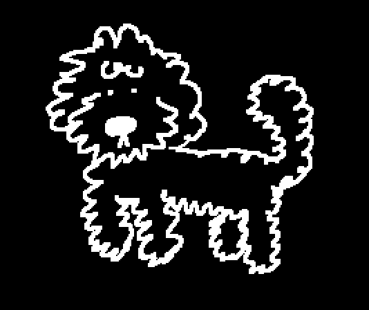
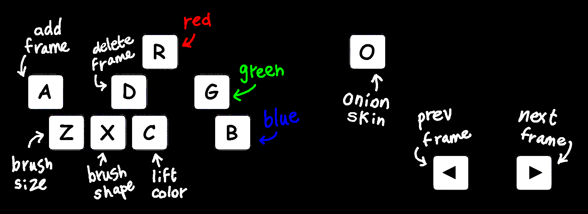

# animus

an infinite canvas for radical digital painting.

<!-- > inspired by Kid Pix, Mario Paint, Flipnote Studio, and iScribble. -->

	

## demo
<h3 align="center">
 
	<a href="https://hunterirving.github.io/animus/">click here</a>
  
</h3>

## controls

### mark-making

- click and drag to make marks
- hold `Z` and move your cursor up/down to resize the brush
- hold `X` and move your cursor up/down to change the shape of the brush
- hold any of the , , and/or  keys and move your cursor up/down to change the , , and/or  of the active color
- hold any combination of the above to change size, shape, and/or color at the same time
- hold `C` and click anywhere to pick up the color underneath your brush
- pinch with two fingers to zoom in / out (or use `⌘ +` / `⌘ -`)
- drag with two fingers to pan around the canvas

### animation
- press `A` to add a new frame
- press `D` to delete the current frame
- press `O` to toggle onionskin
- press `←` / `→` to step between frames
	- tap out a rhythm using the arrow keys to set the playback speed
	- the last-tapped direction sets the playback direction
- press `space` to toggle playback
	- you can continue painting while the canvas animates

### importing / exporting
- hold `⌘` (or `ctrl`) and press `S` to save your painting as a .GIF file
- hold `⌘` (or `ctrl`) and press `O` to open an existing painting from your filesystem (will clear the current canvas)

### multiplayer
run `./serve.py` and share the printed URL with anyone on your local network.